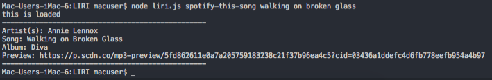
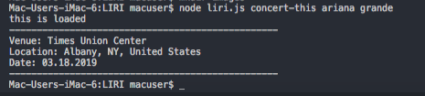
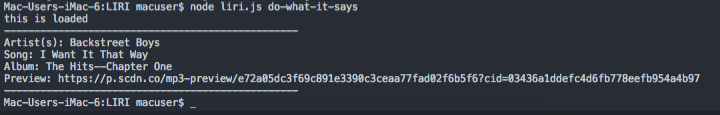

##### LIRI
 
### INTRO

LIRI is a command line interface application that provides the user with various search results.  The user can promt LIRI to search for songs on spotify, search for concerts by musical artist, find movies on OMDB by movie title, and read a file to execute the actions enclosed in that file.  

### Dependencies:

the LIRI app requires that the user run a node install of the following dependencies:
    *axios
    *moment
    *node-spotify-api
    *moment

### Getting Started:
Before gettin started, the user will have to acquire their own spotify, OMDB, and BandsInTown API keys.  The API calls that LIRI makes will not be able to go through without these keys.

The LIRI app will fire off one function before exiting program.  Thus, the user must input the command they wish to execute on the same command line as the one used to run the program.  That is to say that running `node liri.js` will not provide the user with any functionality.  The commands that LIRI can execute are detailed below.

### Searching for tracks on Spotify:

Enter `node liri.js spotify-this-song name of song goes here` into your command line, replacing "name of song goes here" with whichever song name you would like to search for.  Liri is smart enough to read songs with spaces between song names, so don't worry about wrapping your search query in quotes.

If entered correctly, LIRI will prompt the user with the artist(s), the song name, the album name, and a link to listen to a preview of the song like so:

*known error*: Song titles that have an apostrophe in them (') will cause a malfunction with the LIRI song search.  I'm pretty sure that this has something to do with LIRI reading the apostrophe as an opening single quote, then not being able to find the ending quote

### Searching for Movies on OMDB:

Enter `node liri.js movie-this name of movie goes here` into your command line, replacing "name of movie goes here" with whichever movie name you would like to search for.  Liri is smart enough to read movies with spaces between movie names, so don't worry about wrapping your search query in quotes.

If entered correctly, LIRI will prompt the user with the movie title, the year it came out, the movie's rating on IMDB, the movie's rating on Rotten Tomatoes, the country/ies in which the movie was filmed, the language(s) spoken in the movie, a short summary of the plot, and a list of actors that appear in the movie like so:

*known error*: movie titles that have an apostrophe in them (') will cause a malfunction with the LIRI song search.  I'm pretty sure that this has something to do with LIRI reading the apostrophe as an opening single quote, then not being able to find the ending quote

### Searching for Conerts by Artist on Bands In Town:

Enter `node liri.js concert-this name of artist goes here` into your command line, replacing "name of artist goes here" with whichever artist name you would like to search for.  Liri is smart enough to read artists with spaces between artist names, so don't worry about wrapping your search query in quotes.

If entered correctly, LIRI will prompt the user with the venue, location, and date of the artist's next concert like so:

*known error*: movie titles that have an apostrophe in them (') will cause a malfunction with the LIRI song search.  I'm pretty sure that this has something to do with LIRI reading the apostrophe as an opening single quote, then not being able to find the ending quote

### Using External files for LIRI to read:
Enter `node liri.js do-what-it-says` into your command line.  This will read the enclosed file `random.txt` and do what the command in the file says. `random.txt` is currently set up to spotify the song "I want it that way" by the backstreet boys.  You can replace the command in that file with any of the commands explained above and LIRI should be able to execute your command.  This is illustrated in the screenshot below:

### END

Yeah, that's about it.

